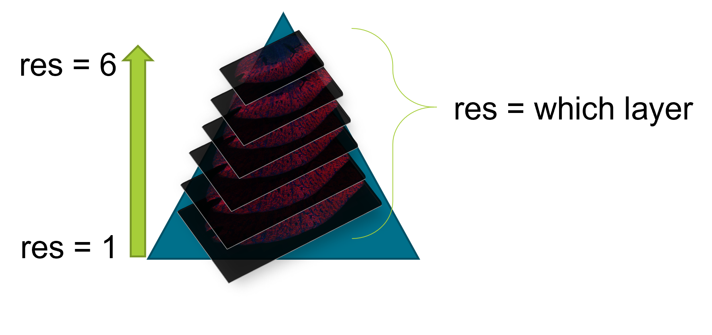

```{r setup, include=FALSE}
knitr::opts_chunk$set(
  message = FALSE,
  warning = FALSE,
  fig.width = 10
)
```

# Overview

This vignette demonstrates how to use the OME-TIFF to enhance the data visualization for a NanoString GeoMx experiment. SpatialOmicsOverlay was specifically made for the free-handed nature of Region of Interest (ROI) selection in a GeoMx experiment. The overlay from the instrument is recreated in the R environment allowing for plotting overlays with data like ROI type or gene expression. 

In this vignette, we will be walking through a mouse brain dataset from the [Spatial Organ Atlas](https://nanostring.com/products/geomx-digital-spatial-profiler/spatial-organ-atlas/mouse-brain/)

# Data Ingestion 

```{r Load Libraries}
library(SpatialOmicsOverlay)
library(GeomxTools)
```

Files needed:

1. OME-TIFF from GeoMx instrument (other OME-TIFFs should work with custom parsing functions)
2. Lab Worksheet from instrument readout
3. Annotation file(s)
    - Lab Worksheet
    - GeomxSet Object (see [GeomxTools](http://www.bioconductor.org/packages/release/bioc/html/GeomxTools.html) for more info)
    - Annotations from DSPDA

Reading in the SpatialOverlay object can be done with or without the image. We will start without the image as that can be added later. 

If outline = TRUE, only ROI outline points are saved. This decreases memory needed and figure rendering time downstream. If ANY ROIs are segmented in the study, outline will be FALSE. 

```{r Read in Data}
muBrainLW <- system.file("extdata", "muBrain_LabWorksheet.txt", 
                         package = "SpatialOmicsOverlay")

tifFile <- downloadMouseBrainImage()

muBrain <- readSpatialOverlay(ometiff = tifFile, annots = muBrainLW, 
                              slideName = "4", image = FALSE,  
                              saveFile = FALSE, outline = FALSE)
```
The readSpatialOverlay function is a wrapper for all of the necessary file readins: XML extraction & parsing, image extraction, and coordinate generation. Functions can also be run separately if desired. 

# SpatialOverlay Accessors 

SpatialOverlay objects hold data specific to the image and the ROIs. Here are a couple of functions to access the most important parts.
```{r object accessors}
#full object
muBrain

#sample names
head(sampNames(muBrain))

#slide name
slideName(muBrain)

#metadata of ROI overlays
head(meta(overlay(muBrain)))

#coordinates of each ROI
head(coords(muBrain))
```

# Plotting Without Image

Figures can be plotted without the image in the object. These figures are the most high resolution versions since there is no scaling down to the image size. Because of this they might take a little bit to render. If the image is attached to the object, coordinates are automatically scaled down to the image size and plotted as if they are on top of the image.

While manipulating the figure, there is a low resolution option for faster rendering times.

A scale bar is automatically calculated when plotting. This functionality can be turned off using scaleBar = FALSE. Scale bars can be fully customized using corner, textDistance, and variables that start with scaleBar: scaleBarWidth, scaleBarColor, etc.

```{r plot w/o image Sample_ID}
plotSpatialOverlay(overlay = muBrain, hiRes = FALSE, legend = FALSE)
```

colorBy, by default, is Sample_ID but almost anything can be added instead: gene expression, tissue morphology, pathway score. These annotations can come from a data.frame, matrix, GeomxSet object, or vector. 

```{r add plotting factors}
muBrainAnnots <- readLabWorksheet(lw = muBrainLW, slideName = "4")
muBrainGxT <- readRDS(system.file("extdata", "muBrain_GxT.RDS", 
                                  package = "SpatialOmicsOverlay"))

muBrain <- addPlottingFactor(overlay = muBrain, annots = muBrainAnnots, 
                             plottingFactor = "segment")
muBrain <- addPlottingFactor(overlay = muBrain, annots = muBrainGxT, 
                             plottingFactor = "Calm1")
muBrain <- addPlottingFactor(overlay = muBrain, annots = 1:length(sampNames(muBrain)), 
                             plottingFactor = "ROILabel")

muBrain

head(plotFactors(muBrain))
```

All generated figures are ggplot based so they can be easily customized.

**Note: hiRes and outline figures use fill, lowRes uses color**
```{r customizable ggplot}
plotSpatialOverlay(overlay = muBrain, hiRes = FALSE, colorBy = "Calm1", 
                   scaleBarWidth = 0.3, scaleBarColor = "green") +
    viridis::scale_color_viridis()+
    labs(title = "Calm1 Expression in Mouse Brain")
```

# Adding the Image

Images can be added automatically using readSpatialOverlay(image = TRUE) or added after reading in the object. 

An OME-TIFF file is a pyramidal file, meaning that many sizes of an image are saved. The largest having the highest resolution and decreasing as the image gets smaller. Images are 1/2 the size as the previous resolution. 

```{r pyramidal tiff, echo=FALSE, fig.cap="Pyramidal TIFF", out.width = '50%'}

```

The res variable says which resolution of the image to extract. 1 = largest image and the higher values get smaller. Each OME-TIFF has a different number of layers, with most having around 8. It is suggested to use the smallest res value your environment can handle. Using too big of an image will cause a java memory error. If this error occurs, increase your res value. 

```{r java error, error=TRUE}
muBrain <- addImageOmeTiff(overlay = muBrain, ometiff = tifFile, res = 1)
```

The resolution size will affect speed and image resolution through the rest of the analysis. To check the smallest resolution size available, for the fastest speeds, use checkValidRes(). For the rest of this tutorial we will be using res = 6. 

```{r add image}
res <- 6
checkValidRes(ometiff = tifFile)
muBrain <- addImageOmeTiff(overlay = muBrain, ometiff = tifFile, res = res)

muBrain

showImage(muBrain)
```

```{r plot with image}
plotSpatialOverlay(overlay = muBrain, colorBy = "segment", corner = "topcenter", 
                   scaleBarWidth = 0.5, textDistance = 130, scaleBarColor = "cyan")
```

# Image Manipulation

### Cropping 

Images can be cropped 2 ways. Buffer in both functions is the percent of buffer to add on all sides. 

1. cropTissue automatically detects where the tissue is and decreases the amount of background around the tissue.

```{r crop tissue}
muBrain <- cropTissue(overlay = muBrain, buffer = 0.05)

plotSpatialOverlay(overlay = muBrain, colorBy = "ROILabel", legend = FALSE, scaleBar = FALSE)+
    viridis::scale_fill_viridis(option = "C")
```
2. cropSamples automatically crops the image around the ROIs given. Other ROIs in the cropped image can be kept in or ignored

```{r crop samples}
samps <- muBrainAnnots$Sample_ID[muBrainAnnots$segment == "Full ROI"]

muBrainCrop <- cropSamples(overlay = muBrain, sampleIDs = samps, sampsOnly = TRUE)

plotSpatialOverlay(overlay = muBrainCrop, colorBy = "Calm1", scaleBar = TRUE, corner = "bottomleft", textDistance = 5)+
    scale_fill_gradient2(low = "grey", high = "red", mid = "yellow", midpoint = 2500)

muBrainCrop <- cropSamples(overlay = muBrain, sampleIDs = samps, sampsOnly = FALSE)

plotSpatialOverlay(overlay = muBrainCrop, colorBy = "segment", scaleBar = TRUE, corner = "bottomleft", textDistance = 5)
```

### Flipping Axes

Images and overlays can be flipped across either axis

```{r flip axes}
plotSpatialOverlay(overlay = flipY(muBrain), colorBy = "segment", scaleBar = FALSE)

plotSpatialOverlay(overlay = flipX(muBrain), colorBy = "segment", scaleBar = FALSE)
```

### Image Coloring

Image colors are typically determined before downloading the OME-TIFF from the instrument but can be recolored here. 

This recoloring must be done on the 4 channel image before converting to RGB. The color code and min/max intensities determine the coloring of the RGB image. 

The color can be a hex color or an R color name. The dye can either come from the Dye or DisplayName columns from fluor(overlay)

```{r image coloring}
chan4 <- add4ChannelImage(overlay = muBrain)

fluor(chan4)

chan4 <- changeImageColoring(overlay = chan4, color = "#32a8a4", dye = "FITC")
chan4 <- changeImageColoring(overlay = chan4, color = "magenta", dye = "Alexa 647")

chan4 <- changeColoringIntensity(overlay = chan4, minInten = 500, 
                                 maxInten = 10000, dye = "Cy5")

fluor(chan4)

# change 4 channel TIFF to RGB
chan4 <- recolor(chan4)

showImage(chan4)
```

# Future Directions

In future releases of SpatialOmicsOverlay, we will be 

1. Ensuring capability with [CosMx](https://nanostring.com/products/cosmx-spatial-molecular-imager/)
2. Adding ability to graph on top of image 
3. Adding image analysis capabilities 
4. Adding extraction of image data to use in ML applications

```{r}
sessionInfo()
```
